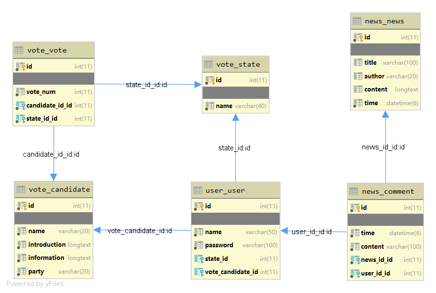

# 2020AmericaElectionWebsite


## 简介

2020美国总统大选投票网站，为中级软件实作的后端系统（阴间主题

用户可以注册账号，然后选择心仪的总统候选人为他打call~(ﾉﾟ∀ﾟ)ﾉ 

可以浏览新闻，还自带实名评论功能（。


## 说明

开发人员：why

框架：Django

数据库：MySQL

架构风格：RESTful

前端指向：https://github.com/5522MIKE/AmericaElectionWebsite_frontend


为了测试方便，debug模式默认开启，middleware中的session拦截默认关闭，CSRF验证默认关闭

上线需要开启

## 系统架构

### 目录结构

> |-- LICENSE
> |-- README.md
> |-- mysite
>     |-- manage.py
>     |-- mysite
>     |   |-- asgi.py
>     |   |-- settings.py
>     |   |-- urls.py
>     |   |-- wsgi.py
>     |-- news
>     |   |-- admin.py
>     |   |-- apps.py
>     |   |-- models.py
>     |   |-- tests.py
>     |   |-- urls.py
>     |   |-- views.py
>     |-- user
>     |   |-- admin.py
>     |   |-- apps.py
>     |   |-- models.py
>     |   |-- tests.py
>     |   |-- urls.py
>     |   |-- views.py
>     |-- utils
>     |   |-- UtilException.py
>     |   |-- handler.py
>     |   |-- middleware.py
>     |-- vote
>         |-- admin.py
>         |-- apps.py
>         |-- models.py
>         |-- tests.py
>         |-- urls.py
>         |-- views.py

### 架构说明

Django采用MVT模式，与MVC模式相似

- 模型层（models）：使用ORM映射模型到数据库表，相当于Model和Dao
- 视图层（views）：负责处理用户的请求并返回响应。相当于Service
- 模板层（template）：由于采用前后端分离，故模板层舍弃
- 路径转发（urls）：转发URL，相当于Controller


## 模块说明

### user

user代表用户，对处理用户的登录、注册、登出、投票等一系列操作进行处理

### news

news代表新闻，对获取新闻、获取新闻列表、获取评论等一系列操作进行处理

### vote

vote代表选票，对获取候选人，获取每个州的信息等一系列操作进行处理

### util

工具包，是系统的一些工具类和中间件

- handler：自定义500，404，400，403的错误处理器，返回json格式数据，在urls.py中开启

- middleware：中间件，内置process_request和process_exception，在settings.py中开启

  - process_request

    验证session，用于判断用户是否登录

  - process_exception

    用于接收全局抛出的异常并处理返回，注意：不处理405错误

- UtilException：自定义异常，用于返回异常json数据


## 数据库




## 接口规范

**统一返回格式**

```json
{
    "status": 200,
	"code": 1,
	"msg":"xxxx成功",
	"data":{}
}
```

| 字段名 |   名称   |                 说明                  |                             其他                             |
| :----: | :------: | :-----------------------------------: | :----------------------------------------------------------: |
| status |  状态码  |              http状态码               |        200操作成功<br />403被拦截<br />500服务器错误         |
|  code  |  请求码  |             操作的状态码              | 1表示成功<br />0表示未登录<br />-1表示查询对象不存在<br />-2表示参数有误<br />后续可根据具体情况定义 |
|  msg   | 返回消息 | 对某个操作的返回信息，可用于前端alter |                  ‘xxx成功’<br />‘xxxx失败’                   |
|  data  | 返回数据 |      返回的具体数据，可能为null       |                      数据格式需求自定义                      |

**所有请求都需加上CSRF的token验证，后续不再说明**

**发送POST请求用application/x-www-form-urlencoded请求头！！！**

**别问，问就是django的QueryDict只支持这个格式的解析填充（。**

---

【需求】用户登录

【请求方式】POST

【URL】/user/login

【参数】id（string）password（string）

【说明】此处传回原始密码，无需加密

【返回】：

| code |              msg              |
| :--: | :---------------------------: |
|  1   |           登录成功            |
|  -1  | 该用户不存在/密码有误，请重试 |

```json
{
  "data": {
    "id": "",
    "name": "",
    "state": "",
    "vote_candidate": ""}
}
```

---

【需求】用户注册

【请求方式】POST

【URL】/user/register

【参数】id（string）name（string）password（string）state（string）

【说明】可以重名，不可以重id，state为用户所在州的id

【返回】

| code |      msg       |
| :--: | :------------: |
|  1   |    注册成功    |
|  -3  | 该用户已被注册 |

```json
{
  "data": {
    "id": "",
    "name": "",
    "state": "",
    "vote_candidate": ""
  }
}
```

---

【需求】用户退出登录

【请求方式】DELETE

【URL】/user/logout

【参数】

【说明】通过删除session完成退出登录

【返回】

| code |           msg           |
| :--: | :---------------------: |
|  1   | 退出登录成功/已退出登录 |
|  -3  |      退出登录失败       |

```json
{
  "data": {}
}
```

---

【需求】用户投票

【请求方式】POST

【URL】/user/vote

【参数】id（string）candidate_id（string）

【说明】id（用户id）candidate_id（候选人id）

【返回】

| code |          msg          |
| :--: | :-------------------: |
|  1   |       投票成功        |
|  -1  |     候选人不存在      |
|  -2  | session与提交id不一致 |
|  -3  |   该用户已完成投票    |

```json
{
  "data": {
    "id": "",
    "name": "",
    "password": "",
    "state": "",
    "candidate": ""
  }
}
```

---

【需求】获取候选人

【请求方式】GET

【URL】/vote/candidate/{id}

【参数】id（string）

【说明】获取候选人的信息，如果id为空默认返回全部

【返回】

| code |        msg        |
| :--: | :---------------: |
|  1   | 获取Candidate成功 |
|  -1  | 获取Candidate失败 |

```json
{
  "data": {
    "id": "",
    "name": "",
    "introduction": "",
    "information": "",
    "party": ""
  }
}
```

---

【需求】获取州的信息

【请求方式】GET

【URL】/vote/state/{id}

【参数】id（string）

【说明】获取单个州的信息，如果id为空默认返回全部

【返回】如果是单个则返回字典，如果是全部返回列表

| code |      msg      |
| :--: | :-----------: |
|  1   | 获取State成功 |
|  -1  | 获取State失败 |

```json
{
  "msg": "获取Candidate信息成功",
  "data": [
    {
      "state": {
        "id": 1,
        "name": "Alabama"
      },
      "vote": [
        {
          "candidate_id": 1,
          "vote_num": 11,
          "candidate_name": "trump"
        }
      ]
    },
    {
      "state": {
        "id": 3,
        "name": "Arizona"
      },
      "vote": []
    }
  ]
}
```

---

【需求】获取新闻

【请求方式】GET

【URL】/news/{id}

​			/news/offset/{page}/{size}

【参数】id为新闻id

​				page: 当前页数 (1-based)

​				size: 当前每页数量

【说明】获取新闻列表，id为空默认返回全部

​				不设置page和size后台默认返回20条

​				默认按照time排序，如果有后续查询需求可以在注释中加上

【返回】如果是单个则返回字典，如果是全部返回列表

| code |     msg      |
| :--: | :----------: |
|  1   | 获取News成功 |
|  -1  | 获取News失败 |

```json
{
  "data": [
    {
      "id": "",
      "title": "",
      "author": "",
      "content": "",
      "time": ""
    }
  ]
}
```

---

【需求】获取评论

【请求方式】GET

【URL】/news/{id}/comment/page/{page}/size/{size}

【参数】id为新闻id

​				page: 当前页数 (1-based)

​				size: 当前每页数量

【说明】获取新闻列表，id为空默认返回全部

​				不设置page和size后台默认返回20条

​				默认按照time排序，如果有后续查询需求可以在注释中加上

【返回】如果是单个则返回字典，如果是全部返回列表

| code |       msg       |
| :--: | :-------------: |
|  1   | 获取Comment成功 |
|  -1  | 获取Comment失败 |

```json
{
  "data": [
    {
      "id": "",
      "time": "",
      "content": "",
      "news_id": "",
      "user_name": ""
    }
  ]
}
```